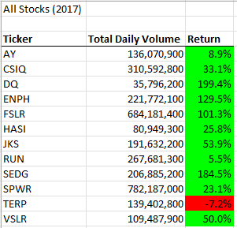
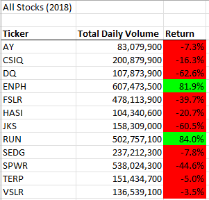
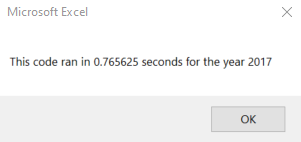
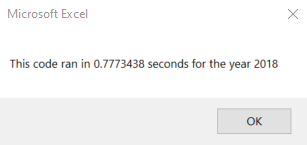
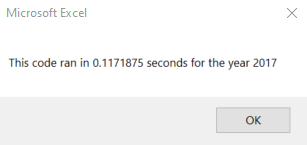
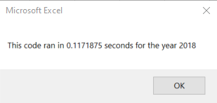

# Stock Analysis with VBA

## Overview of the Project

### Purpose

Steve wants to analyze the entire stock market over the last few years in order to help determine which stocks his parents should invest in. Because they are interested in green technologies, they initially wanted to invest everything in DAQO New Energy Corporation, which has the ticker DQ. However, Steve helped encourage them to diversify, and decided to analyze 12 different green companies first. We need to create an efficeint macro that is able to scan through the data and print out the Total Daily Volume and Return for not only 12 companies, but the entire stock market. 

## Results

### Stock Performance: 2017 vs 2018

If we look at the stock returns for 2017, in the image below, then you can see that all the stocks are up except for TERP. In fact, DQ, SEDG, ENPH, and FSLR were all above a 100% return. Unfortunately, looking at the stock returns for 2018, in the image below, all the stocks were down except for ENPH and RUN. It seems if you bought based on the 2017 returns, then you bought most of the stocks at their peak. If we look at DQ, which Steve's parents wanted to invest in, it's down 62.6%, so it likely wouldn't be a good idea to invest in them now (without some expert knowledge). Even a diversified portfolio in just green energy companies would not have performed well. While that isn't to say it wouldn't perform better in the future, Steve is wise to believe his parents should diversify their stocks across the entire stock market.  

### Execution Times: Original vs Refactored Script

As you can see in the images below, the refactored macro took less than 1/6th the amount of time to run as the original macro. This is largely because in the original macro a for loop was run through all the tickers, and then a nested for loop ran through all the data for each ticker. In the refactored code a single for loop is used to go through all the data once while the information for each ticker was stored in arrays. 

Original Macro Execution Times

Refactored Macro Execution Times

## Summary
- Advantages or disadvantages of refactoring code

Refactored code can be more efficient, which can save a lot of time and money in a business setting, as well as improve an existing product. Additionally, refactored code can be more readable, making it easier to understand what's being done. The downsides are that it can take time to refactor the code, and it is essential that the code is tested and works before replacing the old code. One final disadvantage could be that people who were used to the old code will need to reaquaint themselves with the new code.

- How do these pros and cons apply to refactoring the original VBA script? 

The refactored macro ran more than 6x faster than the original macro. In my opinion the code is also easier to understand as you only go through the data once adding values to arrays, and then you print those values with formatting afterwards. There were some initial issues getting correct return values (needed to use closing price on both the Starting and Ending values), however once fixed the output matched what was expected. While it did take time to refactor the original VBA script, if this was a process that was run every day on a much larger file, then the increase in speed would be worth it.
