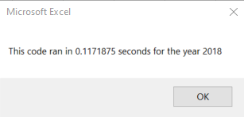

# Stock Analysis with VBA

## Overview of the Project

### Purpose

## Results

### Stock Performance: 2017 vs 2018

### Execution Times: Original vs Refactored Script

Original Macro Execution Times

Refactored Macro Execution Times

## Summary
- Advantages or disadvantages of refactoring code

Refactored code can be more efficient, which can save a lot of time and money in a business setting, as well as improve an existing product. Additionally, refactored code can be more readable, making it easier to understand what's being done. The downsides are that it can take time to refactor the code, and it is essential that the code is tested and works before replacing the old code. One final disadvantage could be that people who were used to the old code will need to reaquaint themselves with the new code.

- How do these pros and cons apply to refactoring the original VBA script? 

